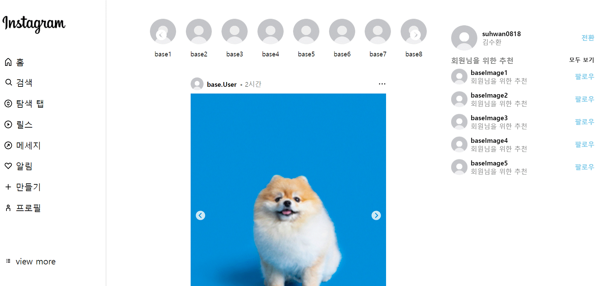
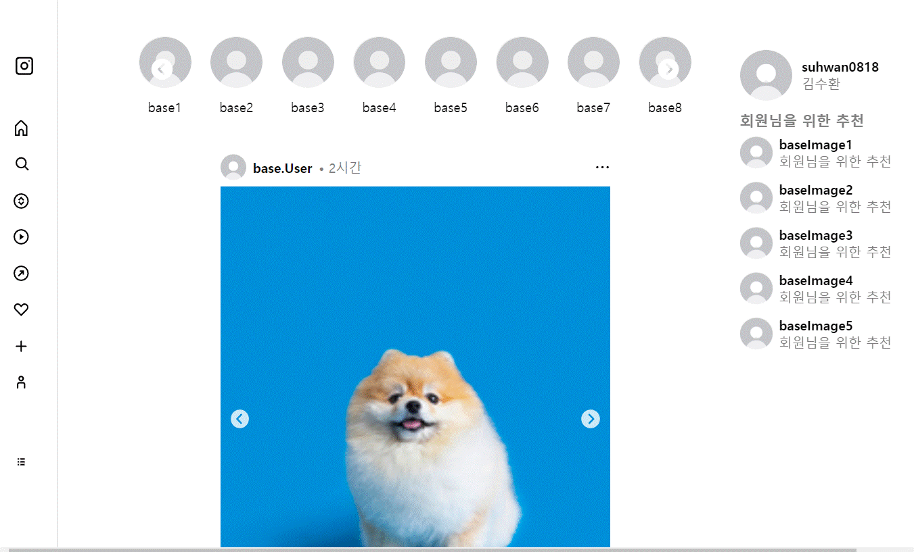

# Instagram Clone Coding  

> 해당 클론 코딩은 [카카오 프론트엔드 기초 교육](https://tech.kakao.com/2023/03/27/2023-new-krew-onboarding-fe/)을 참고하였습니다.  

### 사용 기술  
```ReactJS, Styled-components, eslint, prettier```  

### 개발 기간
3일 (실질 개발 10시간 정도)  

카카오에 들어가 실제로 개발 숙제를 받았다는 생각으로 짧게 진행해봤습니다. axios 정도만 쓰면 바로 API연결 가능하도록 생각하며 짰습니다. 나중에 Spring boot를 배울 생각인데 좀 익히면 연동해볼까 계획중입니다.  

### 결과물  
PC 화면  
  
Tablet 화면  
  

나중에 영상 녹화될때 움짤로 바꿔야겠습니다... 영상 녹화가 왜 안먹히지...